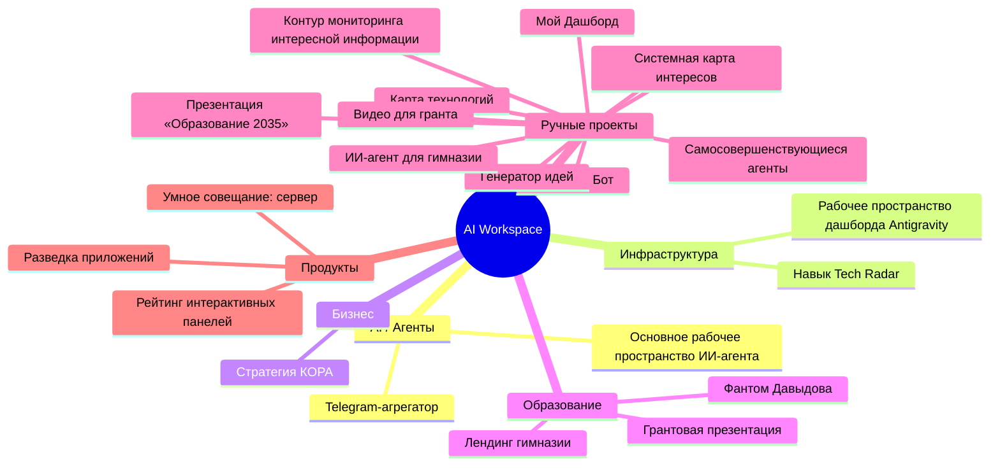

# AI Workspace Overview

- Обновлено: **2026-03-18T23:27:46**
- Проектов: **22**
- Чатов: **38**
- Workflows: **21**

## Разделы
- [[Projects/AI Workspace/00_INDEX]]
- [[Chats/AI Workspace/00_INDEX]]
- [[Workflows/AI Workspace/00_INDEX]]

## Mindmap (Mermaid)
