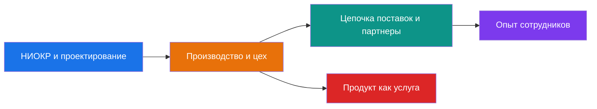
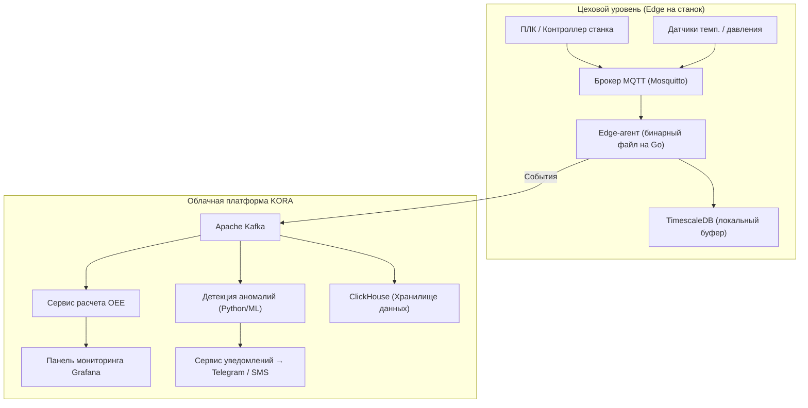
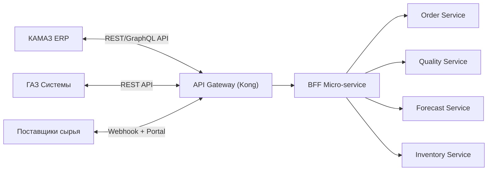
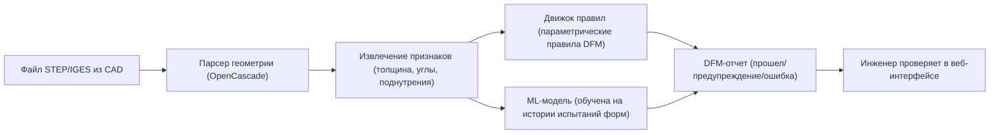
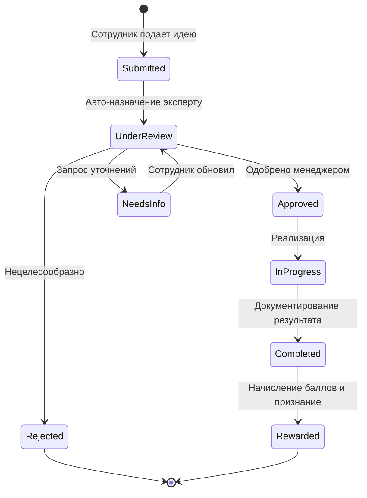

# Группа КОРА — Стратегический отчет «Цифровая нить» (Digital Thread)
### От производителя автокомпонентов к цифровой промышленной платформе

---

> **Подготовлено для:** Исполнительного комитета Группы КОРА, г. Набережные Челны
> **Дата:** Февраль 2026 г.
> **Классификация:** Стратегический — для внутреннего использования

---

## 1. Резюме

Группа КОРА занимает критически важную позицию в цепочке поставок автомобильной отрасли России, производя пластиковые детали интерьера, кабины спецтехники и узлы в сборе для таких OEM-гигантов, как КАМАЗ и ГАЗ. Сегодня конкурентное преимущество в этом сегменте определяется не только себестоимостью детали или качеством оснастки. Оно определяется **скоростью обработки данных**: тем, насколько быстро информация проходит путь от датчика на пресс-форме до подтверждения заказа клиентом.

Настоящий отчет предлагает концепцию **«Цифровой нити»** — единой, прослеживаемой архитектуры данных, соединяющей все этапы: от идеи в НИОКР до производства, поставки и эксплуатации продукта в полевых условиях. Стратегия разбита на **пять столпов**, каждый из которых содержит конкретные приложения, прогноз окупаемости (ROI) и руководство по внедрению.



> [!IMPORTANT]
> «Цифровая нить» — это не просто покупка софта. Это **архитектурный принцип**: каждая система должна генерировать и потреблять структурированные события в общей шине данных. Главный риск — зависимость от вендора; главный метод защиты — событийно-ориентированный дизайн и API-first подход.

---

## 2. Столп I — Производство и цех (IIoT и Индустрия 4.0)

### 2.1 Анализ разрывов: Ограничения стандартных ERP/MES для литья пластмасс

Стандартные ERP (1C:ERP, SAP) и универсальные MES-платформы создавались для дискретного или процессного производства. Специфика литья пластмасс выявляет следующие пробелы:

| Область | Стандартное поведение ERP/MES | Что действительно нужно КОРА |
|---|---|---|
| **Детализация цикла** | Отслеживание сроков на уровне заказа | Телеметрия каждого цикла (впрыска) с точностью до миллисекунд по каждой полости |
| **Прослеживаемость материалов** | По партиям / лотам | Партия сырья → параметры сушилки → температура цилиндра → конкретная полость формы → серийный номер детали |
| **Жизненный цикл формы** | Только реестр активов | Счетчик циклов, триггеры превентивного ТО, отслеживание износа конкретных полостей |
| **Классификация брака** | Общие коды отклонений | Специфично для пластика: утяжины, облой, недоливы, деформация, следы горения — с фотофиксацией |
| **Корреляция энергии** | Ежемесячные счета ЖКХ | кВт*ч на каждый впрыск в корреляции с усилием смыкания, временем цикла и температурой среды |

### 2.2 Предлагаемое решение: **KORA.Pulse** — Микросервисы OEE в реальном времени

Легковесный, событийно-ориентированный движок OEE, развернутый на уровне цеха (Edge) с агрегацией в облаке.

**Архитектура:**



**Ключевые метрики, вычисляемые в реальном времени:**

- **Доступность (Availability)** = (Время работы − Внеплановые простои) / Плановое время
- **Производительность (Performance)** = (Идеальное время цикла × Всего деталей) / Время работы
- **Качество (Quality)** = Годные детали / Всего деталей
- **OEE** = Доступность × Производительность × Качество

**Декомпозиция микросервисов:**

| Сервис | Ответственность | Стек |
|---|---|---|
| `shot-cycle-ingestor` | Прием событий с ПЛК, нормализация меток времени | Go + MQTT |
| `oee-calculator` | Расчет OEE в скользящем окне по станку/смене | Rust или Go |
| `downtime-classifier` | Категоризация причин простоя (ввод оператора + ML) | Python + FastAPI |
| `energy-correlator` | Сопоставление данных электросчетчиков с событиями производства | Python + Pandas |
| `alert-dispatcher` | Пороговые уведомления и аномалии | Go + Telegram Bot API |

### 2.3 Предлагаемое решение: **KORA.QualityGate** — Цифровая фиксация брака

Приложение для планшетов (защищенные Android/iPad), развернутое на каждом посту контроля качества.

**Основной процесс:**

1. Оператор сканирует штрих-код детали (или NFC-метку на форме)
2. Приложение автозаполняет: номер детали, ID формы, станок, смену, партию материала
3. Оператор выбирает тип дефекта из **дерева дефектов полимеров** (утяжина → локация → критичность)
4. Камера делает фото; ML-модель на устройстве предварительно классифицирует тип брака (Edge-вывод через TensorFlow Lite)
5. Данные уходят в Kafka; аналитика SPC (статистическое управление процессами) обновляется мгновенно

**Бизнес-ценность:**
- Замена бумажных журналов — устранение 2-дневной задержки в видимости трендов брака
- Фотодоказательства для каждого случая — поддержка корневого анализа и готовность к аудитам OEM
- Точность ML-модели растет со временем — цель: 85%+ автоклассификации брака через 12 месяцев

---

## 3. Столп II — Цепочка поставок и партнерская экосистема (B2B/B2G)

### 3.1 Больше чем EDI: Портал для поставщиков и клиентов **KORA.Connect**

Традиционный EDI обменивается только плоскими заказами и счетами. Для поставщика уровня Tier-1 (КАМАЗ/ГАЗ) возможности интеграции гораздо шире:

**Функционал портала по ролям:**

| Стейкхолдер | Функция | Ценность |
|---|---|---|
| **Клиент (КАМАЗ, ГАЗ)** | Статус заказа в реальном времени (не только ASN) — прогресс производства по строкам | Устранение звонков «Где мой заказ?»; рост доверия |
| **Клиент** | Общая панель качества — тренды PPM, отчеты 8D, документы PPAP | Позиционирование КОРА как прозрачного, готового к аудитам партнера |
| **Клиент** | Совместное прогнозирование — загрузка сигналов спроса, КОРА подтверждает мощности | Снижение «эффекта хлыста»; оптимизация закупок сырья |
| **Поставщики сырья** | VMI-панель (запасы под управлением поставщика) — видимость остатков складских запасов КОРА | Поставщики пополняют запасы проактивно; КОРА снижает страховой запас на ~15% |
| **Партнеры по оснастке** | Портал заказов на формы — запросы котировок, статус ремонта, утверждение затрат | См. раздел 3.2 |

**Агрегация интеграции (API-first):**



### 3.2 **KORA.ToolTrack** — Управление жизненным циклом пресс-форм

Пресс-формы — это капитальные вложения от **50 тыс. до 500 тыс.+ долларов** за единицу. Большинство заводов ведут их учет в Excel.

**Цифровой жизненный цикл:**

| Этап | Цифровая возможность |
|---|---|
| **Ввод в эксплуатацию** | Цифровой двойник: 3D-модель, схема полостей, спецификации материала, критерии приемки |
| **Учет наработки** | Автоматический счетчик циклов (интеграция с ПЛК) — триггер ТО по достижении лимита |
| **Обслуживание** | Управление нарядами: плановое ТО, внеплановый ремонт, история восстановления |
| **Деградация** | Анализ трендов: корреляция брака по конкретной полости с наработкой — прогноз замены |
| **Списание / Передача** | Полный аудит для форм, принадлежащих клиенту (актуально для OEM-заказов) |

**Стек:** Легкий CRUD-сервис (NestJS или Go) + PostgreSQL + интеграция с KORA.Pulse для данных о наработке.

---

## 4. Столп III — НИОКР и проектирование (PLM и дизайн)

### 4.1 **KORA.DFMCheck** — AI-помощник для проверки технологичности (DFM)

Инженеры часто нарушают ограничения литья — неравномерная толщина стенок, недостаточные углы съема, поднутрения. Это обнаруживается поздно (на испытаниях формы), что ведет к дорогостоящим доработкам.

**Предлагаемый AI-конвейер:**



**Примеры правил (v1):**
- Равномерность толщины стенки: предупреждение при отклонении > 25%
- Угол съема: ошибка при < 1° на внешних поверхностях
- Соотношение ребра к стенке: предупреждение, если ребро > 60% толщины стенки
- Точка впрыска: рекомендации на основе эвристик потока

**ML-улучшение (v2):**
- Обучение на исторических данных КОРА: 3D-модель → итог испытаний (выход годного с первого раза)
- Прогноз «вероятности успеха первой отливки» — флаг риска до заказа формы

**Бизнес-ценность:** Сокращение итераций испытаний на 30–40% → **экономя $200–500 тыс. в год** на программе из 50 форм.

### 4.2 **KORA.PartsLib** — База знаний стандартных деталей

Каждый проект кабины заново изобретает кронштейны, клипсы и бобышки. Решение — параметрическая библиотека проверенных конструкций:

- **Поиск по функции:** «виброгасящая опора, болт M8, нагрузка 40 кг»
- **Визуальный поиск:** загрузите эскиз, найдите геометрически похожие детали
- **Состав карточки:** 3D-модель, чертеж, спецификация материала, проверенные параметры литья
- **Управление:** НИОКР-лиды курируют базу; новые детали добавляются через workflow утверждения

**Стек:** Web-app (React + Three.js для 3D), поиск Meilisearch, поиск по 3D-подобию через эмбеддинги PointNet в pgvector.

---

## 5. Столп IV — Опыт сотрудников и корпоративный HR-Tech

### 5.1 **KORA.Life** — Внутренний Супер-апп (Mobile-First)

Единое мобильное приложение (Flutter — iOS/Android), заменяющее бумажные бланки, доски объявлений и разрозненные порталы.

**Разбивка модулей:**

| Модуль | Пользователи | Функции |
|---|---|---|
| **Кайдзен / Банк идей** | Все | Подача идей (фото + текст); голосование; статус рассмотрения; бонусные баллы для магазина мерча |
| **HSE Чек-листы** | Цех, ТО | Цифровые чек-листы безопасности; отчеты об инцидентах с фото; автоматическая эскалация менеджеру по ОТ и ТБ |
| **Мой график** | Рабочие цеха | Календарь смен из MES; запросы на сверхурочные; биржа обмена сменами с утверждением мастера |
| **Оплата и льготы** | Все | Расчетные листы; баланс отпуска; запись в столовую / корпоративный спортзал |
| **Карпулинг** | Все | Поиск попутчиков для промзоны Челнов; стыковка по маршрутам и сменам |
| **Новости и обучение** | Все | Объявления КОРП; трекинг обязательных инструктажей; микро-обучение (видео по 2 мин) |

**Механика вовлечения:**
- **Геймификация:** Баллы за идеи, обучение и безопасность → Лидерборды → Призы
- **Push-уведомления:** Напоминание о смене, алерты по ТБ, статус идеи
- **Offline-first:** Критичные функции (чек-листы) работают без сети, синхронизация при появлении связи

### 5.2 Программа Кайдзен — Цифровой процесс



---

## 6. Столп V — Продукт как услуга (Цифровая добавленная стоимость)

### 6.1 **KORA.SmartCabin** — Цифровые опции для кабин спецтехники

КОРА производит высокомаржинальные кабины для спецтехники. Цифровая дифференциация здесь позволяет устанавливать премиальную цену.

**Предлагаемые цифровые функции:**

| Функция | Оборудование | Софт | Ценность для клиента |
|---|---|---|---|
| **Умное освещение** | Адресные LED-ленты (встроены при сборке) | Приложение BLE: настройка температуры света, яркости, циркадные ритмы | Комфорт оператора → снижение усталости за 12ч смену |
| **Модуль телематики** | Защищенный IoT-шлюз (4G/GPS) в кабине | Облачная панель: часы наработки, локация, удары/вибрации, температура | Владелец парка видит утилизацию; доказательная база для гарантии |
| **Предиктивный сервис** | Датчики вибрации и влажности | ML-модель: прогноз износа уплотнений, замены фильтров HVAC | Снижение внеплановых простоев техники |
| **Цифровой паспорт и мануал** | NFC-метка в кабине + QR на узлах | AR-приложение: навел камеру на деталь → увидел инструкцию, артикул, кнопку заказа | Отказ от бумажных книг; быстрое обслуживание в поле |

**Сдвиг бизнес-модели:**
- **Продажа железа** (традиционная): разовая выручка
- **Цифровая подписка** (новая): ежемесячная плата за телематику, аналитику и обновления ПО
- **Цель:** Рост выручки на 15–20% с каждой кабины за 5-летний жизненный цикл

---

## 7. Сводная стратегическая таблица

| # | Домен | Болевая точка | Решение | Бизнес-ценность | Сложность | Рекомендуемый стек |
|---|---|---|---|---|---|---|
| 1 | Производство | Нет данных об эффективности в реальном времени; OEE вручную в конце смены | **KORA.Pulse** — IIoT-движок OEE (Edge + Облако) | +5–10% к OEE → экономия $1M+/год | **Высокая** | Go, MQTT, Kafka, TimescaleDB, ClickHouse, Grafana |
| 2 | Качество | Бумажные журналы брака; задержка 2 дня в аналитике; нет фото | **KORA.QualityGate** — Планшеты для фиксации брака с ML-анализом | Снижение времени реакции на брак на 50%; прозрачность для OEM | **Средняя** | Flutter, TensorFlow Lite, Kafka, PostgreSQL |
| 3 | Цепочка поставок | Клиенты постоянно звонят узнать статус; прогнозирование в Excel | **KORA.Connect** — B2B-портал для КАМАЗ/ГАЗ и поставщиков сырья | Устранение 80% звонков по статусам; снижение складских запасов на 15% | **Высокая** | React, NestJS, Kong API GW, PostgreSQL, Kafka |
| 4 | Ассеты | Учет форм в Excel; срывы ТО → простои; нет истории наработки | **KORA.ToolTrack** — Цифровой паспорт формы с интеграцией счетчика циклов | -20% внеплановых простоев форм; легкий учет собственности клиента | **Средняя** | NestJS/Go, PostgreSQL, KORA.Pulse API |
| 5 | НИОКР | Ошибки дизайна находят на испытаниях; дорогой ремонт форм | **KORA.DFMCheck** — Проверка геометрии на технологичность через AI | -30–40% итераций испытаний → экономия $200–500k/год | **Высокая** | Python, OpenCascade, PyTorch, React, FastAPI |
| 6 | НИОКР | Повторная разработка типовых узлов (кронштейны, клипсы) | **KORA.PartsLib** — Библиотека стандартных деталей с 3D-превью | -20% времени на проектирование новых проектов кабин | **Средняя** | React, Three.js, Meilisearch, pgvector |
| 7 | HR / Кадры | Малое участие в Кайдзен из-за бумаги; нет обратной связи | **KORA.Life — Кайдзен** — Мобильная подача идей с геймификацией | Рост числа поданных идей в 3-5 раз; реальная экономия затрат | **Низкая** | Flutter, Supabase/Firebase, PostgreSQL |
| 8 | ОТ и ТБ | Бумажные чеклисты; инциденты фиксируются поздно | **KORA.Life — HSE** — Цифровые чеклисты с фото и авто-эскалацией | Рост регистрации «почти-инцидентов» на 200%; автоматизация комплаенса | **Низкая** | Flutter, offline sync, PostgreSQL |
| 9 | Операции | Графики на досках; сложность с транспортом в промзоне | **KORA.Life — График и Попутчик** — Календарь смен, биржа обмена, карпулинг | Снижение нагрузки на HR на 30%; рост лояльности сотрудников | **Низкая** | Flutter, GraphQL, PostgreSQL, Maps API |
| 10 | Продукт | Кабины как разовое «железо»; нет данных об использовании | **KORA.SmartCabin** — Встроенная телематика + сервисы по подписке | +20% выручки с каждой кабины; переход к сервисной модели | **Высокая** | C/Rust (Edge), AWS IoT, React (Dashboard), TimescaleDB |

---

## 8. Дорожная карта внедрения

```mermaid
gantt
    title Цифровая нить КОРА — 24-месячный план
    dateFormat  YYYY-Q
    axisFormat  %Y-Q%q

    section Этап 1 — Фундамент (Q1–Q2 2026)
    Платформа данных и Kafka-шина       :p1a, 2026-Q1, 2026-Q2
    KORA.Life MVP (Кайдзен + HSE)      :p1b, 2026-Q1, 2026-Q2
    Пилот KORA.Pulse (5 станков)       :p1c, 2026-Q1, 2026-Q2

    section Этап 2 — Ядро (Q3–Q4 2026)
    Полное развертывание KORA.Pulse    :p2a, 2026-Q3, 2026-Q4
    Внедрение KORA.QualityGate          :p2b, 2026-Q3, 2026-Q4
    KORA.ToolTrack v1                   :p2c, 2026-Q3, 2026-Q4
    KORA.Life (График + Попутчик)      :p2d, 2026-Q3, 2026-Q4

    section Этап 3 — Экосистема (Q1–Q2 2027)
    Портал KORA.Connect (пилот КАМАЗ)  :p3a, 2027-Q1, 2027-Q2
    KORA.PartsLib v1                   :p3b, 2027-Q1, 2027-Q2
    Движок правил KORA.DFMCheck         :p3c, 2027-Q1, 2027-Q2

    section Этап 4 — Лидерство (Q3–Q4 2027)
    ML-модели KORA.DFMCheck             :p4a, 2027-Q3, 2027-Q4
    Пилот KORA.SmartCabin               :p4b, 2027-Q3, 2027-Q4
    Полная интеграция с OEM клиентами   :p4c, 2027-Q3, 2027-Q4
```

---

## 9. Архитектурные принципы платформы

| Принцип | Обоснование |
|---|---|
| **Event-driven (Kafka как стержень)** | Каждая система публикует события; потребители независимы; легкая интеграция новых сервисов в будущем |
| **API-first (OpenAPI 3.1)** | Все сервисы имеют описанный API; готовность к B2B интеграции и новым фронтендам |
| **Edge + Cloud гибрид** | Цеховые данные обрабатываются локально (resilience); аналитика — в облаке |
| **Контейнеризация (Kubernetes)** | Независимость от инфраструктуры (свое облако или внешнее); масштабируемость и стабильность |
| **Встроенная наблюдаемость** | Трассировка OpenTelemetry, метрики Prometheus, логи ELK с первого дня — это не факультатив, а база |

---

## 10. Организационные факторы успеха

> [!WARNING]
> Технологии сами по себе не создают ценности. Следующие изменения обязательны:

1. **Digital Product Team** — Внутренняя кросс-функциональная команда (Product Owner, 4–6 разработчиков, UX-дизайнер, Data-инженер), встроенная в бизнес КОРА. Нельзя полностью отдавать платформу на аутсорс.

2. **Data Governance** — Назначение владельцев данных по доменам (Производство, Качество, Закупки). Определение «контрактов данных» (схемы, правила качества) до начала разработки.

3. **Управление изменениями** — Агенты влияния в цехах. Моментальные поощрения за использование цифровых инструментов. Нулевая терпимость к «параллельным бумажным процессам».

---

## 11. Оценка инвестиций (порядок величин)

| Категория | Год 1 | Год 2 | Поддержка (в год) |
|---|---|---|---|
| **Инфраструктура и Платформа** | $150K–$250K | $80K–$120K | $60K–$100K |
| **Разработка ПО** (команда + подрядчики) | $400K–$600K | $350K–$500K | $300K–$400K |
| **Оборудование IIoT** (датчики, планшеты) | $100K–$200K | $50K–$100K | $20K–$40K |
| **Разработка ML/AI** (DFM, аномалии) | $50K–$80K | $100K–$150K | $50K–$80K |
| **Обучение и внедрение** | $50K–$80K | $30K–$50K | $20K–$30K |
| **Итого** | **$750K–$1.2M** | **$610K–$920K** | **$450K–$650K** |

---

> [!TIP]
> **Начинайте с малого, доказывайте ценность, масштабируйтесь быстро.** Самый большой риск — это не техника, а инерция организации. Быстрые победы первого этапа (Kaizen-приложение и пилот OEE) призваны создать доверие за 90 дней.

---

## 12. Специальный модуль: Интеграция юбилея 2026
### Тема: «35 / 400 / 50 — Объединенные историей, движимые будущим»

> **Контекст:** В 2026 году Группа КОРА отмечает тройной юбилей:
> - **35 лет** — Группа КОРА (основана в 1991 году)
> - **400 лет** — Набережные Челны (юбилей города)
> - **50 лет** — Первый автомобиль КАМАЗ (ключевая веха главного клиента)

Этот модуль предлагает **12-месячную кампанию цифрового вовлечения**, встроенную в платформы KORA.Life и KORA.Connect, чтобы отпраздновать эти вехи, повысить принятие цифровых инструментов и улучшить операционные показатели.

### 12.1 Кампания цифрового вовлечения (KORA.Life)

**Цель кампании:** Превратить рутинные операционные задачи в коллективное празднование наследия компании и города. Кампания длится с 1 января по 31 декабря 2026 года.

#### Игровая механика 1: «Золотая партия» (OEE и Качество)
**Цель:** Поднять OEE выше 85% и снизить уровень брака.
- **Концепция:** Каждая смена, выполнившая цель по OEE, вносит вклад в виртуальные «километры» цифрового путешествия, посвященного 400-летию города.
- **Механика:**
    -   **Цель:** Собрать 400 «Золотых партий» (идеальных смен) по всему заводу.
    -   **Визуал:** Прогресс-бар на цеховых экранах показывает цифровой КАМАЗ, проезжающий через исторические эпохи Набережных Челнов (1626 Поселение -> 1970-е Стройка -> 2026 Умный город).
    -   **Награда:** За каждые 50 «Золотых партий» открывается общегородской подарок (например, пожертвование в местный парк или розыгрыш билетов на концерт).
    -   **Лично:** Рабочие «Золотой смены» получают бейдж «Основатель 1991» в профиле.

#### Игровая механика 2: «Страж безопасной смены» (HSE)
**Цель:** Увеличить отчетность о «почти-инцидентах» и проактивное поведение.
- **Концепция:** Празднование 35 лет безопасной работы через выявление 3500 проактивных наблюдений.
- **Механика:**
    -   **Действие:** Подача валидного отчета об опасности или предложения по ТБ через KORA.Life приносит «Балл Щита».
    -   **Уровни:**
        -   **Разведчик (5 баллов):** Цифровой сертификат.
        -   **Авангард (15 баллов):** Наклейка на каску «Страж безопасности» + ваучер на кофе.
        -   **Центурион (35 баллов):** Специальная брендированная спецодежда «Юбилейная версия» (Золотой логотип KORA).
    -   **Лидерборд:** «Топ Стражей» показывают на ежемесячном собрании.

#### Игровая механика 3: «Ретро-инновации» (Кайдзен)
**Цель:** Модернизация устаревших процессов с помощью новых цифровых инструментов.
- **Концепция:** Объединение мудрости прошлого с инструментами будущего.
- **Механика:**
    -   **Вызов:** «Найти процесс, не менявшийся с 90-х, и предложить цифровое исправление».
    -   **Подача:** Сотрудники присылают идеи в формате «Тогда и Сейчас» (например, «Бумажный журнал 1995 vs Планшет 2026»).
    -   **Награда:** Победные идеи получают бейдж «Ретро-футурист» и существенный бонус (например, 35 000 руб.).
    -   **Голосование:** Голосование коллег за самые смешные или драматичные сравнения.

### 12.2 B2B Функция: «Совместный путь» (KORA.Connect)

**Цель:** Укрепление стратегического партнерства с ключевыми клиентами (КАМАЗ, ГАЗ) через визуализацию общего успеха.

**Концепция функции:** Интерактивный виджет-таймлайн на дашборде клиентского портала KORA.Connect.

**Ключевые визуализации:**
1.  **«50 лет движения»:** Таймлайн, показывающий точки интеграции КОРА с историей КАМАЗа.
    -   *Пример вехи:* «1995: КОРА поставляет первую панель приборов для КАМАЗ-5460».
    -   *Пример вехи:* «2015: Запуск совместной разработки кабины К5».
2.  **«Счетчик 15 миллионов деталей»:** Живой счетчик общего количества деталей, поставленных клиенту за историю партнерства, обновляемый в реальном времени по цифровым накладным.
3.  **«Серия качества»:** Праздничный виджет, показывающий количество дней подряд с 0 PPM брака, под лозунгом «Защищая легенду» (отсылка к репутации грузовиков КАМАЗ).

**Бизнес-ценность:** Подтверждает статус КОРА не просто как вендора, а как неотъемлемой части истории и успеха клиента.

### 12.3 Функция цифрового наследия: «Голос мастеров»

**Цель:** Сохранить и оцифровать племенные знания ветеранов (стаж 15+ лет) перед их выходом на пенсию.

**Концепция функции:** Видео-вики знаний внутри KORA.Life для сохранения «Духа 1991».

**Компоненты:**
1.  **«Мастер-класс» (Shorts):**
    -   Ветераны записывают 2-минутные видео о специфических сложных станках или формах.
    -   *Промпт:* «Какой есть один секрет для плавной работы формы №45, которого нет в инструкции?»
2.  **«Моя самая трудная смена»:**
    -   Компонент сторителлинга, где ветераны делятся историями преодоления кризисов в 90-е или 00-е.
    -   Формирует культуру и ценности устойчивости у молодого поколения Z.
3.  **AI-тегирование и поиск:**
    -   Все видео транскрибируются и тегируются бэкендом KORA.Life.
    -   Новичок, ищущий «дефект формы №45», мгновенно получает видео-совет ветерана.

**Мотивация:**
-   Контрибьюторы получают статус **«Легенда КОРА»** в приложении (постоянная золотая рамка аватара).
-   Ежегодный «Ужин Легенд» с Генеральным директором для топ-контрибьюторов.

### 12.4 Основы внедрения на 2026 год

| Функция | Технические требования | Сроки запуска |
| :--- | :--- | :--- |
| **Золотая партия (OEE)** | Интеграция с KORA.Pulse (движок OEE) + Логика геймификации | **1 янв 2026** (Старт) |
| **Совместный путь (B2B)** | Импорт исторических данных в БД KORA.Connect + React компонент таймлайна | **15 фев 2026** (50 лет КАМАЗ) |
| **Страж безопасной смены** | Модуль HSE KORA.Life + Система бейджей | **28 апр 2026** (День охраны труда) |
| **Голос мастеров** | Сервис загрузки и стриминга видео (S3/HLS) + API транскрипции | **Авг 2026** (Подготовка ко Дню города) |
